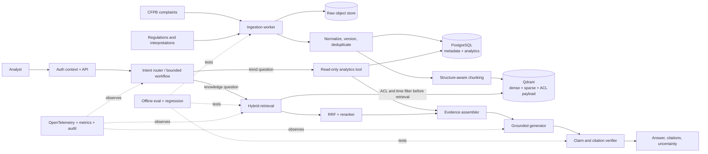

# RAG 企业实战实施与教学方案 v1

更新日期：2026-08-23  
项目暂定名：**EvidenceOps — 金融投诉与合规证据 Copilot**

## 1. 先给结论

不继续做泛化的“企业知识库聊天机器人”，也不立即堆 Agent、Memory、GraphRAG。

推荐把项目冻结为一个具体业务系统：

> 面向投诉运营、合规分析和审计人员，把真实消费者投诉、监管条文、官方解释与结构化趋势数据连接起来，回答“发生了什么、证据在哪里、适用哪一版规则、哪些结论仍需人工确认”。

选择这个场景的原因：

1. **有真实数据**：CFPB Consumer Complaint Database 提供公开投诉、分类、日期、公司响应和经脱敏后公开的投诉叙述；数据通常每日更新。
2. **RAG 是必要能力**：法规和解释有层级、版本和生效时间，回答必须给出可核验引用，不能只靠模型记忆。
3. **能自然扩展为 Agent**：同一任务既要查非结构化法规与案例，也要执行结构化趋势查询，再生成证据报告。
4. **能做可信评测**：投诉自带产品、问题、子问题等弱标签；法规有稳定章节标识；可以构建检索、引用、时间、权限和拒答测试。
5. **能说明企业价值**：目标不是“聊天”，而是缩短找证据和形成初步分析的时间，同时保留人工复核、审计轨迹与风险边界。

这个项目不提供法律结论，也不自动对消费者或公司采取行动。它是**内部证据检索与分析辅助系统**。

## 2. 对现有交接材料的审计

附件中有 8 个文本文件，包含目标、架构、技术选型、路线、面试叙事和一份“给下一位 Agent 的指令”。最后一份只作为历史材料读取，没有把它当成用户授权执行。

### 应保留

- 模块化单体起步；
- 模型、Embedding、向量库通过接口隔离；
- 混合检索、重排、引用；
- 评测和回归是一等能力；
- ACL、版本、增量索引、可观测性；
- Python、FastAPI、PostgreSQL、Docker Compose。

### 必须修正

- “PostgreSQL + Qdrant + Elasticsearch + Redis”在第一阶段状态源过多。Qdrant 已支持 dense/sparse 与 RRF，第一版无需同时维护 Elasticsearch；先用 PostgreSQL 做业务真相源，Qdrant 做混合检索。
- CloudPay 示例是生成的演示知识，只适合契约测试，不适合作为简历项目的核心业务证据。
- Hash Embedding、Memory Vector Store、Mock LLM 只可用于单元测试，不能用于作品集结果或指标。
- 不能在检索基线尚未量化前加入自由规划 Agent；否则无法判断问题来自检索、工具选择还是生成。
- “自我优化”不能让系统在线自动修改 Prompt、索引或策略。生产做法应是：收集失败样本 → 离线实验 → 锁定测试集 → 人工批准 → 灰度/回滚。
- 原来的 4 周功能表缺少数据许可、数据血缘、删除传播、时态检索、PII、威胁测试、SLO、成本预算和业务代理指标。

### 当前事实边界

旧共享对话显示曾经生成过一个 `adaptive-rag-platform` 工程包，并声称本地测试通过；但这次提供的 ZIP 只有交接文本，没有源码、测试结果或数据。因此在拿到源码前，不能把 Sprint 1 视为已验收。

## 3. 如何寻找真实业务场景

以后选择任何 RAG 场景，都用以下五问筛选：

1. **谁在做什么决定？** 不能只说“员工提问”，要明确用户、工作流和输出。
2. **错误的代价是什么？** 如果答案错了也没有后果，通常只是 Demo。
3. **知识为什么必须检索？** 是否会变化、是否分散、是否需要权限、版本和引用？
4. **真实反馈从哪里来？** 是否有标签、历史处理结果、专家复核、日志、行为指标或可复现环境？
5. **不用 LLM 的基线是什么？** 先证明关键词搜索/规则/SQL做不到，再证明 RAG 带来增量。

候选比较：

| 场景 | 真实数据 | RAG 必要性 | 可评测性 | 企业辨识度 | 主要问题 |
|---|---:|---:|---:|---:|---|
| 金融投诉与合规证据 Copilot | 高 | 高 | 高 | 高 | 需明确非法律建议和数据偏差 |
| 平台运维/事故 Copilot | 中高 | 高 | 中高 | 高 | 本地运行真实集群和故障成本较高 |
| 泛企业知识库 | 低 | 中 | 低 | 低 | 缺少真实私有数据，最容易变成 Chat with PDF |

所以第一主线选择“投诉 + 合规”；运维 Copilot 留作后续迁移挑战，用来证明系统不是只适用于一个领域。

## 4. 数据如何获取

### 4.1 核心公开数据

| 数据 | 获取方式 | 用途 | 关键限制 |
|---|---|---|---|
| CFPB Consumer Complaint Database | 官方 CSV ZIP 或 Open Data API | 投诉叙述检索、相似案例、趋势 SQL、反馈标签 | 不是总体消费者的统计样本；叙述是当事人陈述，未由 CFPB 验证 |
| CFPB Interactive Bureau Regulations | 官方法规导航页、章节与官方解释页面 | 层级/版本感知法规 RAG、精确引用 | CFPB 页面便于阅读，但法律研究需核对 eCFR/Federal Register 官方版本 |
| eCFR / Federal Register | 官方开发 API | 正式法规版本、修订和生效日期 | 抓取受限，应走官方 API并保存来源与版本 |
| CFPB 年度投诉报告 | 官方 PDF/HTML | 构建趋势问题、生产输出样例、校验系统分析边界 | 报告是聚合分析，不可当作每条投诉事实的验证 |

已核验入口：

- https://www.consumerfinance.gov/data-research/consumer-complaints/
- https://files.consumerfinance.gov/ccdb/complaints.csv.zip
- https://cfpb.github.io/api/ccdb/fields.html
- https://github.com/cfpb/ccdb5-api/blob/main/swagger-config.yaml
- https://www.consumerfinance.gov/rules-policy/regulations/
- https://www.consumerfinance.gov/rules-policy/final-rules/code-federal-regulations/

当前执行环境对 CFPB API/ZIP 的命令行访问被边缘防护返回 403，但官方页面、字段说明和下载链接已验证。实施时优先从官方浏览器下载一个固定快照；部署环境再验证 API 增量同步。不能把尚未下载的内容写成“已采集”。

### 4.2 第一批数据范围

不要一开始吞下全库。第一可用切片：

- 选择一个产品域，例如 `Credit reporting or other personal consumer reports`；
- 取 12–24 个月、有公开 narrative 的投诉；
- 保留原始 CSV 快照、SHA-256、下载日期和来源 URL；
- 同步该域对应的 CFPB 法规、官方解释和版本元数据；
- 目标规模先控制在 5,000–20,000 条投诉和 200–1,000 个法规/解释章节。

### 4.3 数据资产必须留下什么

每个数据源进入 `source_registry`：

- `source_id`、来源 URL、发布者、许可/使用说明；
- `retrieved_at`、`effective_from`、`effective_to`；
- 内容哈希、原始对象地址、解析器版本；
- 数据分类、tenant、ACL、PII 状态；
- 当前版本、删除/撤回状态、下次检查时间。

原始数据不可被解析结果覆盖。原始快照放 S3/MinIO；PostgreSQL 保存业务状态和血缘；Qdrant 是可重建索引，不是事实源。

## 5. 真正的业务流程

### 用户角色

- 投诉运营分析师：找相似历史案例与典型问题；
- 合规审核人员：查适用条文、版本和证据边界；
- 运营负责人：看趋势、异常和代表性案例；
- 审计人员：复核检索、工具调用、引用和模型版本。

### 第一条端到端任务

> “过去一个季度某产品的投诉量为何上升？主要问题类别是什么？给出代表性投诉证据、相关规则章节、数据局限和需要人工确认的事项。”

系统必须：

1. 将趋势部分路由给只读 SQL/分析工具；
2. 从投诉叙述中检索代表性案例；
3. 从法规和官方解释中检索相关章节；
4. 按 claim 生成引用，保留来源、章节和版本；
5. 对证据不足、时间不匹配或权限不足的结论拒答；
6. 记录 trace、工具参数、候选文档、成本、延迟和模型版本；
7. 让分析师接受、修改或否决引用，反馈进入离线评测队列。

## 6. 目标架构



### 技术选择

- API：Python + FastAPI + Pydantic；
- 业务状态/趋势分析：PostgreSQL + SQLAlchemy + Alembic；
- 原始对象：S3 兼容存储，开发期用 MinIO；
- 检索：Qdrant dense + sparse，RRF；
- Embedding 与 reranker：先设候选集，通过领域评测选择，不凭模型榜单冻结；BGE-M3/BGE reranker 可作为首个候选；
- 异步：先用进程内任务完成最小切片，出现可测吞吐/重试需求后再引入 Redis + worker；
- 模型：OpenAI-compatible gateway，但保存 provider/model/version/参数；
- 可观测：OpenTelemetry trace + Prometheus 指标 + 结构化审计日志；
- 工作流：先实现显式状态机和 schema-validated tool call；只有分支复杂度证明需要时再引入 LangGraph 等框架。

## 7. 分阶段边做边学

每一步必须同时产生四类结果：**可运行代码、可复现实验、你自己的解释、下一步回归基线**。

### Phase 0 — 场景、数据契约与基线（第 1 周）

学习：RAG 为什么是检索系统而不是 Prompt 技巧；数据血缘、gold set、泄漏。  
实现：仓库骨架、Docker Compose、source registry、固定数据快照、数据字典。  
你要完成：解释为什么这个问题不能只用全文搜索或只用 LLM。  
验收：一条命令启动；一条命令下载/导入固定切片；快照有哈希和来源；测试可重复。

### Phase 1 — 可观测的关键词检索基线（第 2 周）

学习：倒排索引、BM25/FTS、Precision/Recall、MRR/nDCG。  
实现：法规结构解析、投诉规范化、关键词检索 API、候选与 score trace。  
你要完成：亲手诊断 10 个失败查询并建立失败分类。  
验收：锁定首版检索集；输出 Recall@5/10、MRR、p95；不能只有“看起来不错”的示例。

### Phase 2 — Dense Retrieval 与 Chunking 实验（第 3 周）

学习：Embedding、语义相似、chunk 边界、parent-child retrieval、领域漂移。  
实现：dense index、结构感知 chunker、文档/章节/段落稳定 ID。  
你要完成：比较三种 chunking，不看答案先预测各自失败模式。  
验收：实验表说明 dense 相比 lexical 在哪些 query class 上改善或退化。

### Phase 3 — Hybrid + RRF + Reranker（第 4–5 周）

学习：候选召回与排序的区别、RRF、cross-encoder、hard negatives。  
实现：dense/sparse 并行、RRF、可选 reranker、metadata/time/ACL pre-filter。  
你要完成：独立解释一个“reranker 让总体指标变差”的可能原因。  
验收：同一锁定集比较 lexical、dense、hybrid、hybrid+reranker；每项有质量、延迟、成本。

### Phase 4 — Grounded Generation 与引用（第 6 周）

学习：context engineering、claim decomposition、faithfulness、拒答。  
实现：evidence packet、句子级引用、引用存在性/覆盖验证、无证据拒答。  
你要完成：给 20 个答案做 blind review，再对比自动 evaluator。  
验收：引用精确率、引用覆盖率、faithfulness、拒答准确率达到预设门槛；LLM judge 不是唯一裁判。

### Phase 5 — SQL 工具与受控 Agent Workflow（第 7 周）

学习：tool schema、状态机、路由、只读 SQL、防无限循环。  
实现：知识检索工具、趋势 SQL 工具、证据聚合、有限步数 verifier。  
你要完成：手写一个错误计划并解释系统如何阻止它。  
验收：工具选择准确率、SQL 执行正确率、端到端任务成功率；禁止自由执行任意 SQL。

### Phase 6 — 生产数据工程（第 8 周）

学习：幂等、重试、增量索引、版本、删除传播、重建。  
实现：任务状态机、内容哈希、upsert、tombstone、索引重建和回滚。  
你要完成：注入一次中途失败并恢复，不产生重复版本。  
验收：重复导入不重复；旧版可追溯；删除从对象、数据库、索引按策略传播。

### Phase 7 — 权限、安全与可观测（第 9 周）

学习：tenant isolation、prompt injection、vector leakage、PII、审计。  
实现：检索前 ACL、canary 文档、恶意文档测试、OTel spans、token/cost/latency 指标。  
你要完成：从 trace 定位一次越权候选或慢查询。  
验收：跨 tenant 泄漏为 0；关键链路 trace 覆盖；提示注入和数据投毒测试进入 CI。

### Phase 8 — 评测门禁与作品集（第 10–12 周）

学习：时间切分、回归门禁、A/B、业务代理指标、结果表达。  
实现：版本化 eval 集、实验报告、质量门禁、Demo、架构与 ADR、失败案例册。  
你要完成：不看代码讲清三次设计取舍和两次失败修复。  
验收：新模型/Prompt/检索策略不能在未过质量、泄漏、延迟与成本门禁时合并。

## 8. 我们每轮怎么教与做

每一轮遵循一个短闭环：

1. 我先用当前业务问题解释一个机制，不先灌完整课程；
2. 你先预测结果或写一个小接口/测试；
3. 我们共同完成可运行的最小改动；
4. 跑测试、trace 或 eval，观察真实反馈；
5. 你用自己的话解释“为什么这样设计、何时会失败”；
6. 做一个变体任务，验证你能迁移而不只是照抄；
7. 更新 ADR、实验记录和下一步状态。

学习证据分级：认识 → 无提示解释 → 有支持应用 → 独立诊断 → 独立实现 → 迁移到新场景。README 和 Agent 生成的代码不算你的掌握证据。

## 9. 评测体系

### 数据集设计

- `parser_truth_set`：手工核对表格、标题、章节、脚注、链接和版本；
- `retrieval_regulation`：法规问题 + gold section IDs；
- `retrieval_case_similarity`：投诉查询 + 人工相关性等级 + hard negatives；
- `temporal_set`：问题显式指定时间，gold 为当时有效版本；
- `acl_set`：同文不同 tenant/role 的允许与拒绝组合；
- `answer_set`：claim、参考证据、允许的回答边界和拒答条件；
- `adversarial_set`：提示注入、隐藏指令、冲突来源、空证据、超长文档。

投诉分类字段只作为弱标签和采样依据，不直接冒充高质量 gold relevance。最终测试集需要人工复核，并按时间切分，避免同源近重复泄漏。

### 指标与门禁

| 层 | 指标 | 第一版建议门槛（目标，不是现有成绩） |
|---|---|---|
| 摄取 | parse coverage、duplicate rate、freshness、重跑幂等 | 关键字段覆盖 100%；重复导入无新增重复版本 |
| 检索 | Recall@5/10、MRR、nDCG@10、temporal accuracy | 相对 lexical baseline 有统计/样本层面的可解释增益 |
| 权限 | unauthorized candidate rate | 0；越权内容不能进入候选集 |
| 生成 | claim citation precision/coverage、faithfulness、abstention | 核心事实均有可打开引用；无证据正确拒答 |
| Agent | tool choice、SQL correctness、task success、step count | 受控步骤内完成；错误工具/SQL可被拦截 |
| 运行 | p50/p95、TTFT、token、cost/query、trace coverage | 先测基线，再设 SLO；每次回归不得无说明恶化 |
| 业务代理 | time-to-first-evidence、引用接受率、编辑距离 | 与人工搜索流程做小样本对照 |

RAGAS 等 LLM evaluator 可加速筛查，但需用人工标注子集校准。检索、引用存在性、ACL、SQL 和时态正确性优先使用确定性评测。

## 10. 生产级的红线

以下任一缺失，都不能声称“生产级”：

- 原始数据、解析结果、chunk、embedding、模型和回答可追溯；
- ACL 在检索前生效，而不是答案生成后过滤；
- 文档有版本、生效时间、撤回和删除传播；
- 摄取幂等、可重试、可回滚、可重建；
- 不足证据时拒答，引用能打开到具体段落/章节；
- 有锁定 eval 集和回归门禁；
- 有 prompt injection、数据投毒、跨租户泄漏测试；
- 记录质量、延迟、成本和失败类型；
- Agent 工具最小权限、schema 校验、有限步数、只读默认；
- 公开数据限制写进产品界面和报告，不把投诉量误解为市场伤害率。

## 11. 代码库建议结构

```text
evidenceops-rag/
├─ apps/
│  ├─ api/
│  └─ worker/
├─ src/evidenceops/
│  ├─ domain/
│  ├─ ingestion/
│  ├─ parsing/
│  ├─ indexing/
│  ├─ retrieval/
│  ├─ generation/
│  ├─ workflows/
│  ├─ evaluation/
│  ├─ observability/
│  └─ security/
├─ tests/
│  ├─ unit/
│  ├─ integration/
│  ├─ eval/
│  └─ adversarial/
├─ data/
│  ├─ registry/
│  └─ samples/
├─ evals/
│  ├─ datasets/
│  ├─ runs/
│  └─ reports/
├─ docs/
│  ├─ architecture/
│  ├─ adr/
│  ├─ experiments/
│  └─ runbooks/
├─ infra/
└─ README.md
```

大型原始数据、模型和密钥不进 Git；仓库保存获取脚本、固定 manifest、校验和、小样本与可复现说明。

## 12. 最终简历证据包

最终不是一个 GIF，而是：

- 可运行仓库与一键本地环境；
- 数据卡与来源/许可/偏差说明；
- 架构图、3–5 个 ADR；
- lexical → dense → hybrid → reranker 的实验报告；
- 锁定 eval 集、回归 CI 和失败案例册；
- ACL、时态、注入和删除传播测试；
- 可打开的 trace 与质量/延迟/成本 dashboard；
- 5 分钟演示：趋势问题 → SQL + RAG → 引用报告 → 人工反馈；
- 一篇技术文章：一次失败实验、原因和修复，而不是只介绍功能。

简历描述必须用真实结果替换占位符，例如：

> 构建面向投诉运营与合规分析的证据 Copilot，摄取真实公开投诉与版本化监管文本；实现权限/时间过滤下的 dense+sparse 混合检索、RRF 与重排，并以锁定测试集量化 Recall@10、引用覆盖率、p95 和单次成本。建立增量索引、删除传播、OpenTelemetry trace 与安全回归门禁，使所有关键结论可追溯到具体来源与有效版本。

在实际跑出数字前，不填写提升百分比。

## 13. 下一步

下一次直接进入 **Phase 0 / Sprint 0**：

1. 如果你能提供旧对话中生成的完整源码 ZIP，我们先做可运行性审计并保留可用部分；
2. 如果源码已丢失，就按本方案创建新仓库；
3. 下载 CFPB 固定数据切片与法规样本，生成 source manifest；
4. 建立首批 30–50 个问题的 eval seed；
5. 完成第一份 ADR：为什么先做 lexical baseline，为什么暂不引入 Elasticsearch 和自由规划 Agent。

第一个真正的验收点不是“能聊天”，而是：**给定固定数据和固定问题，系统能可重复地返回候选证据、稳定 ID、来源、版本、分数和 trace。**

## 14. 依据

- 京东软件开发岗（AI 应用方向）：要求业务 Agent、RAG、权限、评测、人工反馈、trace、延迟和后端工程。https://zhaopin.jd.com/web/job-info-detail?requementId=220736
- 京东 AI Agent 产品经理：要求编排、RAG/Memory、Tools、效果追踪、成本控制和平台化抽象。https://zhaopin.jd.com/web/job-info-detail?requementId=212557
- CFPB Consumer Complaint Database：https://www.consumerfinance.gov/data-research/consumer-complaints/
- CFPB 数据字段：https://cfpb.github.io/api/ccdb/fields.html
- Qdrant hybrid/RRF：https://qdrant.tech/documentation/search/hybrid-queries/
- RAGAS 论文：https://arxiv.org/abs/2309.15217
- OWASP Vector and Embedding Weaknesses：https://genai.owasp.org/llmrisk/llm082025-vector-and-embedding-weaknesses/
- NIST GenAI Profile：https://www.nist.gov/publications/artificial-intelligence-risk-management-framework-generative-artificial-intelligence
- OpenTelemetry GenAI conventions：https://opentelemetry.io/docs/specs/semconv/registry/attributes/gen-ai/
